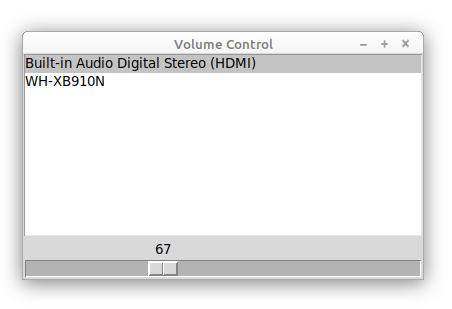

# pa-volume
Pulse Audio volume control for Linux
Some distros of linux (Ubuntu / Mint) typically have quiet volume and even at 100% your audio might be too quiet.

This is a simple Python script using TKinter to control the volume of devices in Linux.

Goals:
- Allows volume up to 200%
- Easy UI
- Simple script (under 100 lines)
- Avoid bloat such as extra modules

Wraps the following commands:
```
pacmd list-sinks
pactl set-sink-volume 1 150%
```



